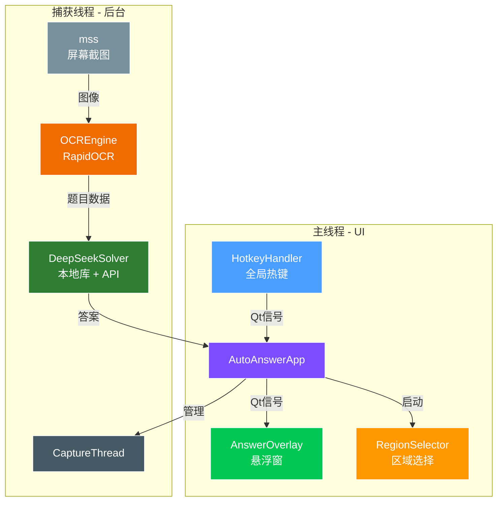

# 🧠 AutoAnswer 智答助手 — AI 智能屏幕答题工具


> **AutoAnswer — AI-Powered Screen OCR Quiz Solver**
>
> **智答助手 — 基于 AI 的屏幕 OCR 智能答题工具**

一款基于 AI 的桌面答题神器。框选屏幕区域，程序自动截图、识别题目文字、解析选项，秒级调用大模型推理出答案，结果直接显示在半透明悬浮窗上——全程无需手动操作。内置 50+ 条本地知识库，命中即返回，响应低至毫秒级；未命中则调用 DeepSeek API 联网搜索作答，准确率极高。OCR 引擎采用 RapidOCR，体积仅 50MB，无需安装庞大的深度学习框架，开箱即用。支持全局快捷键一键框选、暂停、手动触发识别，操作丝滑不打断工作流。适用于线上知识竞赛、时政学习、模拟测验、趣味问答等场景。轻量、快速、安静，藏在后台帮你拿分的那个队友。

---

## 📖 目录

- [项目简介](#-项目简介)
- [功能特性](#-功能特性)
- [系统架构](#-系统架构)
- [快速开始](#-快速开始)
- [配置说明](#-配置说明)
- [快捷键](#-快捷键)
- [项目结构](#-项目结构)
- [性能指标](#-性能指标)
- [常见问题](#-常见问题)
- [开发计划](#-开发计划)
- [许可证](#-许可证)

---

## 🔍 项目简介

**AutoAnswer 智答助手** 是一款结合实时屏幕捕获、光学字符识别（OCR）和大语言模型（LLM）推理的桌面智能答题工具。

它在后台静默运行，持续监控用户指定的屏幕区域。当检测到新题目时，自动提取文字、解析题干与选项、查询 AI 模型，并在悬浮窗中展示答案——全程仅需数秒。

### 适用场景

- 📚 线上知识竞赛与答题活动
- 🏛️ 时政学习与模拟测验
- 📝 限时考试练习与自我评估
- 🎮 趣味问答与互动竞猜

---

## ✨ 功能特性

### 🔤 智能 OCR 识别
- 基于 **RapidOCR**（ONNX Runtime 推理后端），轻量高效，无需安装 PaddlePaddle 框架
- 自动检测并结构化解析题干与 A/B/C/D 选项
- 支持多种选项格式：`A.` / `A、` / `A)` / `A：` / `①` 等
- 基于置信度过滤低质量识别结果，减少误判
- 完整支持中文、中英混排等复杂文本版式

### 🤖 AI 智能推理
- 集成 **DeepSeek API**，支持快速准确的答案推理
- 可选 **联网搜索增强**（`enable_search`），实时获取最新事实信息
- 内置 **本地知识库**，预置 50+ 条目，命中即返回，无需调用 API
- 双层应答策略：本地缓存优先 → API 兜底
- 自动重试机制（最多 3 次），含指数退避策略

### 🖥️ 无感桌面体验
- **半透明悬浮窗**（置顶显示、圆角设计），展示答案不遮挡工作界面
- **可视化区域选择器**，拖拽框选任意屏幕区域作为监控目标
- **全局快捷键** 控制，无需切换窗口
- 线程安全架构：UI 线程与捕获线程通过 Qt 信号完全解耦
- 内容去重：屏幕内容未变化时自动跳过，避免重复处理

### ⚡ 性能优化
- 启动时模型预热，消除首次推理延迟
- 轻量 ONNX 推理，CPU 占用与内存消耗极低
- 可配置扫描间隔，灵活平衡响应速度与资源占用
- 精简 Prompt 设计（`max_tokens=20`，`temperature=0.0`），确保 API 响应快速且确定

---

## 🏗️ 系统架构



**数据流：**
1. `mss` 对用户指定的屏幕区域进行截图
2. `OCREngine`（RapidOCR）提取文字并解析为结构化题目数据
3. `DeepSeekSolver` 优先查询本地知识库，未命中则调用 API
4. 结果通过 Qt 信号传递至 `AnswerOverlay` 悬浮窗展示


---

## 🚀 快速开始

### 环境要求

- Python 3.8 及以上
- Windows 10 / 11（主要适配平台；Linux / macOS 需针对 `keyboard` 和 `mss` 做适配调整）

### 安装依赖


# 克隆仓库
git clone https://github.com/imjianglee1/AutoAnswer_ai.git
cd AutoAnswer

# 安装依赖
pip install PyQt5 mss Pillow keyboard rapidocr_onnxruntime openai


### 配置 API 密钥

打开 `config.py`，填入你的 DeepSeek API 密钥：


DEEPSEEK_API_KEY = "sk-your-api-key-here"


> 🔑 前往 [DeepSeek 开放平台](https://platform.deepseek.com/) 获取密钥

### 启动运行


python main.py


首次启动：
1. 按 `Ctrl+F1` 框选包含题目的屏幕区域
2. 按 `Ctrl+F3` 手动触发一次识别，或按 `Ctrl+F2` 开启连续扫描
3. 答案将在 1–3 秒内显示在悬浮窗中

---


## 配置说明

- **修改提示词**：请编辑 `ai_solver.py` 文件第 149 行，调整 `prompt` 变量内容即可。
- **更换模型提供商**：请编辑 `config.py` 文件，修改 `MODEL_PROVIDER` 相关配置项。

```python
# ai_solver.py 第149行示例
prompt = "请按以下规则求解..."  # 在此处修改你的提示词

# config.py 示例
MODEL_PROVIDER = "openai"  # 可选: openai, anthropic, deepseek


---


## ⚙️ 配置说明

所有配置项集中在 `config.py` 中：

| 参数 | 默认值 | 说明 |
|------|--------|------|
| `DEEPSEEK_API_KEY` | `""` | DeepSeek API 密钥 |
| `DEEPSEEK_BASE_URL` | `https://api.deepseek.com/v1` | API 端点地址 |
| `DEEPSEEK_MODEL` | `deepseek-chat` | 模型选择：`deepseek-chat`（快速）或 `deepseek-reasoner`（推理更强） |
| `DEEPSEEK_ENABLE_SEARCH` | `True` | 是否启用联网搜索以获取更准确的事实性答案 |
| `SCAN_INTERVAL` | `1.0` | 屏幕扫描间隔（秒） |
| `CAPTURE_REGION` | `{left, top, width, height}` | 默认捕获区域（可通过区域选择器覆盖） |

---

## ⌨️ 快捷键

| 快捷键 | 功能 |
|--------|------|
| `Ctrl + F1` | 打开区域选择器 — 拖拽框选屏幕监控区域 |
| `Ctrl + F2` | 暂停 / 恢复连续扫描 |
| `Ctrl + F3` | 手动触发一次识别 |
| `Ctrl + Q` | 退出程序 |

---

## 📁 项目结构


AutoAnswer/
├── main.py               # 程序入口，线程调度，快捷键管理
├── ocr_engine.py         # RapidOCR 封装 — 图像预处理、文字提取、题目解析
├── ai_solver.py          # DeepSeek API 客户端 — 本地知识库查询、API 调用、响应解析
├── overlay.py            # PyQt5 悬浮窗 — 答案展示、自适应尺寸、自动淡出
├── region_selector.py    # 可视化屏幕区域选择器，支持实时坐标反馈
├── config.py             # 集中配置 — API 密钥、快捷键、本地知识库
├── capture_region.json   # 持久化的捕获区域坐标（自动生成）
└── README.md             # 本文件


---

## 📊 性能指标

以下数据在典型桌面环境（Intel i5-12400, 16 GB RAM, 无 GPU）下测得：

| 阶段 | 典型耗时 |
|------|----------|
| 屏幕截图（`mss`） | ~10–30 ms |
| OCR 推理（RapidOCR ONNX） | ~100–300 ms |
| 本地知识库查询 | < 1 ms |
| DeepSeek API 调用（单次） | ~0.5–2.0 s |
| **端到端（调用 API）** | **~1–3 s** |
| **端到端（本地命中）** | **~150–400 ms** |

> 💡 **提示：** 在 `config.py` 的 `LOCAL_KNOWLEDGE` 中添加领域相关条目，可以最大化本地命中率，减少 API 调用次数与延迟。

---

## ❓ 常见问题

<details>
<summary><b>为什么选择 RapidOCR 而不是 PaddleOCR？</b></summary>

RapidOCR 使用 ONNX Runtime 作为推理后端，无需安装庞大的 PaddlePaddle 框架（约 1.5 GB+），优势包括：
- **安装体积大幅缩小**（约 50 MB vs 约 1.5 GB）
- **启动速度更快** — 无框架初始化开销
- **跨平台兼容性更好** — ONNX Runtime 在 Windows、Linux、macOS 上均可稳定运行
- **识别精度相当** — RapidOCR 底层使用与 PaddleOCR 相同的 PP-OCR 模型架构（ONNX 格式）

</details>

<details>
<summary><b>可以使用其他大模型服务商吗？</b></summary>

可以。`DeepSeekSolver` 使用 OpenAI 兼容的 API 格式，你可以将其指向任何支持相同接口的服务商（如 OpenAI、Moonshot / Kimi、智谱 GLM、通过 Ollama / vLLM 部署的本地模型等），只需修改 `config.py` 中的 `DEEPSEEK_BASE_URL` 和 `DEEPSEEK_API_KEY` 即可。

</details>

<details>
<summary><b>支持 Linux 或 macOS 吗？</b></summary>

核心逻辑是跨平台的，但需注意：
- `keyboard` 库在 Linux 上需要 **root / sudo** 权限
- `mss` 屏幕截图在所有平台均可正常工作
- PyQt5 悬浮窗在非 Windows 窗口合成器下的渲染效果可能略有差异

</details>

<details>
<summary><b>如何向本地知识库添加自定义题目？</b></summary>

编辑 `config.py` 中的 `LOCAL_KNOWLEDGE` 字典：


"你的条目名称": {
    "keys": ["关键词1", "关键词2", "关键词3"],  # 匹配触发词
    "answer": "A",                               # 正确选项字母
    "detail": "简要解释说明"                       # 可选的解析
},


识别出的题目文本中只要包含至少一个关键词，即可触发本地匹配。

</details>

<details>
<summary><b>OCR 识别部分文字不准确怎么办？</b></summary>

- 适当放大捕获区域，确保文字没有被裁切
- 确保监控区域有足够的对比度（避免透明或重叠窗口干扰）
- 调整 `_extract_texts()` 中的置信度阈值（默认 `0.4`）— 调高可过滤噪声，调低可捕获更多文字

</details>

---

## 🔮 开发计划

- [ ] 多显示器支持
- [ ] OCR GPU 加速（ONNX CUDA / DirectML）
- [ ] 答题历史记录与导出
- [ ] 大模型服务商插件化
- [ ] 系统托盘集成与通知推送
- [ ] 本地知识库在线更新

---

## 📜 许可证

本项目基于 [MIT 许可证](LICENSE) 开源。

---

<p align="center">
  <sub>使用 RapidOCR、DeepSeek 和 PyQt5 构建 ❤️</sub>
</p>


---

## 修复要点

| # | 问题 | 修复 |
|---|------|------|
| 1 | 徽章用 `<p align="center">` + `` 标签，部分 Markdown 渲染器不识别 HTML | 改为纯 Markdown `` 语法，GitHub 100% 兼容 |
| 2 | 双语标题用 `<p><b>` 嵌套，容易被吞 | 改为 `>` 引用块语法 |
| 3 | 系统架构 ASCII 图表没有被 `  ` 包裹 | 加上 `    ` 代码块，确保等宽渲染 |
| 4 | 顶部简介段落加入了之前你认可的吸引人的中文短描述 | 直接内嵌在标题下方 |
```
